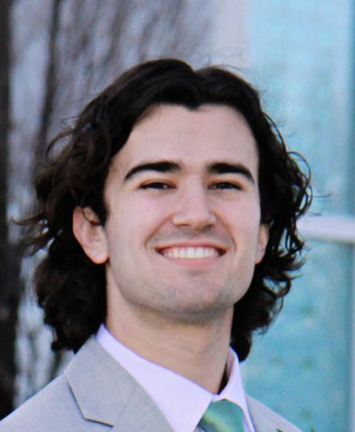

# **About Me**

  

### Introduction
Hello! My name is Seth Kelly. I am a Senior in the Biochemistry major at Brigham Young University with a minor in Statistics. I have a particular interest in mass spectrometry based proteomics. I aspire to use proteomic approaches to understand how protein signaling and post-translational modifications cause disease.

### Education
- Attended Brigham Young University since September 2023
- BS in Biochemistry
- Minor in Statistics
- Expected to graduate in April 2026

### Experience
- Research Assistant in Dr. Brandon Gassaways lab, studying the limitations of phospho-DIA mass spectrometry from March 2024 to present
- Worked as an analytical chemistry TA during the Fall 2024 semester and as a biochemistry lab TA during Winter 2025
- Cloned a tyrosinase domain into a fusion protein plasmid for student use
- Presented research findings on ultra-low input phospho-DIA benchmarking using iterative synthetic phosphoisomers at SRC
- Authored a standard operating procedure for electroporation, protein expression, and purification workflows.

- ### Skills
- - **Laboratory Techniques:** Cell culture, electroporation, protein purification, TMT labelling, western blotting, restriction cloning
- **Programming:** Proficient in Python (numpy, scipy, LinearRegression, pandas, matplotlib) and R
- **Scientific Software:** Proficient with Perseus, SnapGene, ImageJ, and Graphpad Prism
- **Data Analysis:** Experienced in mass spectrometry data processing

- ### Get to Know Me
Outside of professional and academic pursuits, I am an avid gamer, weightlifter and guitarist. I also really enjoy playing board games and card games with my friends and coworkers. A fun fact about me is that I love animals and grew up around cats, dogs, snakes and lizards.
