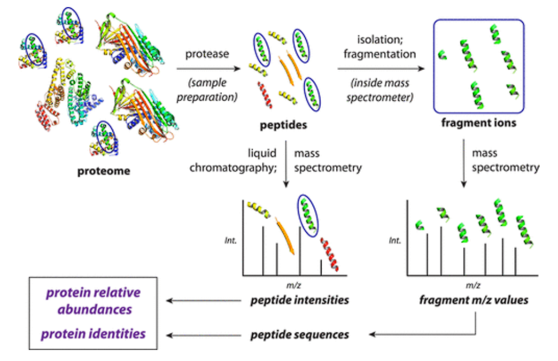
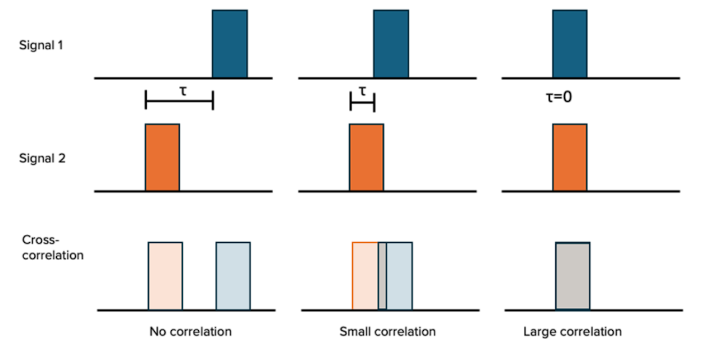

layout: page
title: Decoding the Proteome
permalink: /proteomics/
---

# Decoding the Proteome: How Data Science is Revolutionizing Biology

In data science, we often imagine our careers leading to fintech or ad-tech working to optimize company revenue or wrangle massive survey data. However, some of the most complex, high-stakes, and data-driven questions are actually found in biology, specifically in a subfield called proteomics.

### What is Proteomics and Why Should We Care?

Proteomics is the study of the entire set of proteins expressed by an organism or tissue. We often describe DNA as the "blueprint" of a cell; that blueprint contains the instructions for over 20,000 protein-coding genes. What is even more astonishing is that while humans have roughly 20,000 genes, alternative splicing of DNA and various chemical modifications of proteins result in humans having over 100,000 distinct proteins with even more variants.

Proteins are essentially the workers of our bodies. They are responsible for vital processes like the immune response, cell growth, DNA repair and essentially any other process you could imagine. Unfortunately, even small errors in a protein can cause devastating diseases such as cancer. Traditionally, biochemists could only study a small handful of proteins at a time. Today, the union of High-Resolution Mass Spectrometry (MS) and powerful search algorithms allows us to identify thousands of proteins in a single 15-minute injection. This has revolutionized personalized medicine and drug development, turning biological samples into massive searchable databases.

### How Does This Even Work?

A mass spectrometer acts as a high-precision scale used to identify proteins by weighing them. However, weighing a protein does not directly elucidate its identity. To get usable data, scientists have to go through a physical preprocessing pipeline:

1.  **Breaking Them Down:** Raw proteins are too large to analyze in one piece (Often hundreds or thousands of amino acids long). Scientists use enzymes to break these long chains into manageable strings called peptides (typically 7–30 amino acids long).
2.  **Fragmentation:** The MS isolates a single peptide and shatters it into even smaller fragments. Because proteins break in predictable ways these fragments are unique to that specific sequence.

3.  **The Spectrum (The Raw Data):** The output is a collection of peaks corresponding to the different fragments.

In the field, scientists call this a mass fingerprint. Just as a single fingerprint can identify a person, a single peptide fingerprint can identify a whole protein. The central problem is that these fingerprints are often noisy and unclear. This results in an inverse problem or in other words: Given a messy set of fragment peaks, what was the original string of amino acids?

### Deconvoluting the Noisy Fingerprint

Identifying these fingerprints is a massive candidate ranking and scoring problem. Because of the inherent noise in the instrument, looking for an exact match is impossible. Instead, researchers use algorithms to find the most probable sequence.

### The Evolution: From "Exact Match" to Signal Processing

In the early days of proteomics, identifying a mass fingerprint was treated like a simple SQL Join. Scientists would calculate the total mass of the peptide and look for an exact hit in a database. If the machine measured a mass of 1000.50 Daltons, you looked for a peptide that weighed exactly 1000.50 Daltons.

Unfortunately, in the real world, "exact" doesn't exist. Instruments have drift, and more importantly, two completely different peptides can have the identical total mass. Scientists needed a way to interpret the fingerprint.

#### The First Generation: Bin-and-Match
The first iteration used a "Binning" strategy. They divided the mass spectrum into discrete buckets (bins). If both the experimental data and a theoretical model had a peak in the same spot, this would “count” and increase the likelihood a peptide belonged to the true fingerprint.

This was incredibly brittle. If a peak was even slightly off due to instrument calibration, the "count" would equal 0, even if the match was nearly perfect and only slightly offset. It was a binary solution to a continuous problem.

#### The XCorr Revolution
To solve the "brittleness" of exact matching, researchers pivoted to Signal Processing. Instead of asking "Is there a peak at position X?", they started asking "How similar are these two signals?" This is where the SEQUEST algorithm changed the field by introducing Cross-Correlation (XCorr).

The algorithm overlays your experimental data with a theoretical template. To prove a match is real and not just "background hum," it "slides" your data slightly to the left and right, purposely knocking the peaks out of alignment. If the alignment was a true match, the score plummets the moment you shift it, creating a sharp spike. If the score stays the same when shifted, the algorithm knows it was just looking at meaningless noise. The final XCorr score measures how much your signal "pops" out of the static.

##### The Delta Score
Even a strong XCorr score doesn’t guarantee a match because of Type 1 error, so a layer of logic to measure uniqueness was added: the Delta Score ($\Delta Cn$). This calculates the relative gap between the #1 best guess and the #2 runner-up:

$$\Delta Cn = \frac{XCorr_1 - XCorr_2}{XCorr_1}$$

If the gap is large, there is high confidence that the peptide identity is correct. Conversely, if the scores of the top two are almost identical, the fingerprint is too blurry to distinguish between two different candidates.

### The Final Guardrail: Target-Decoy Searching
The unfortunate reality of XCorr is that if you search a noisy signal against a database of 100,000 proteins, you will always find a "best" match, even if the real protein isn't in your sample. In data science, this is the Multiple Testing Problem.

To solve this, researchers use the Target-Decoy Strategy. They create a "fake" database by reversing all the protein sequences in the database (e.g., ALPHABET becomes TEBAHPLA). The XCorr process is then repeated against both the real (Target) and fake (Decoy) lists. Since a match to a "reversed" sequence is a guaranteed false positive, the number of decoy hits is used to calculate a False Discovery Rate (FDR) of peptides. The researchers then use this FDR to minimize the probability of a false hit in a sample to .01, giving them confidence that the proteins they identified were actually in their sample.

### Wrapping up
Of course, this is merely just scratching the surface in how deep these methods actually go. For more information check out the papers below. I used these to help me learn and understand the methods I discussed above. I hope this helped expand what you initially thought was possible within the field of data science.

